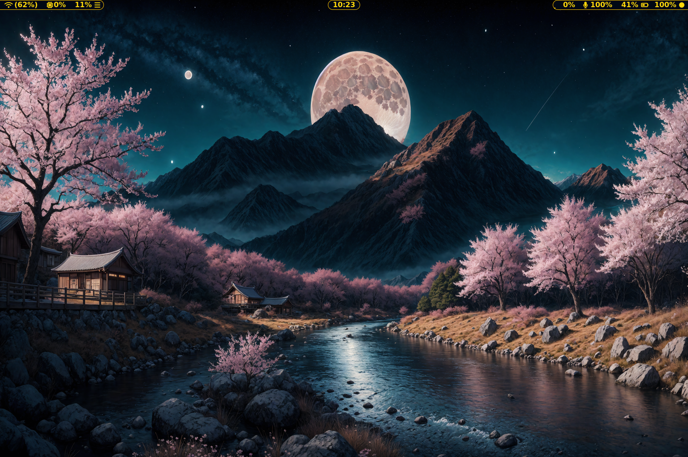
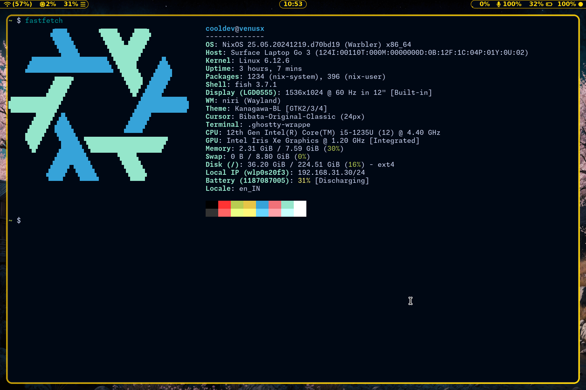
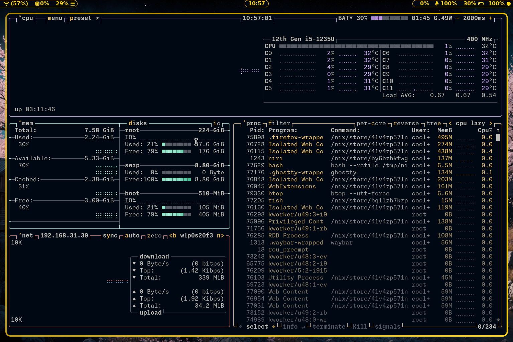
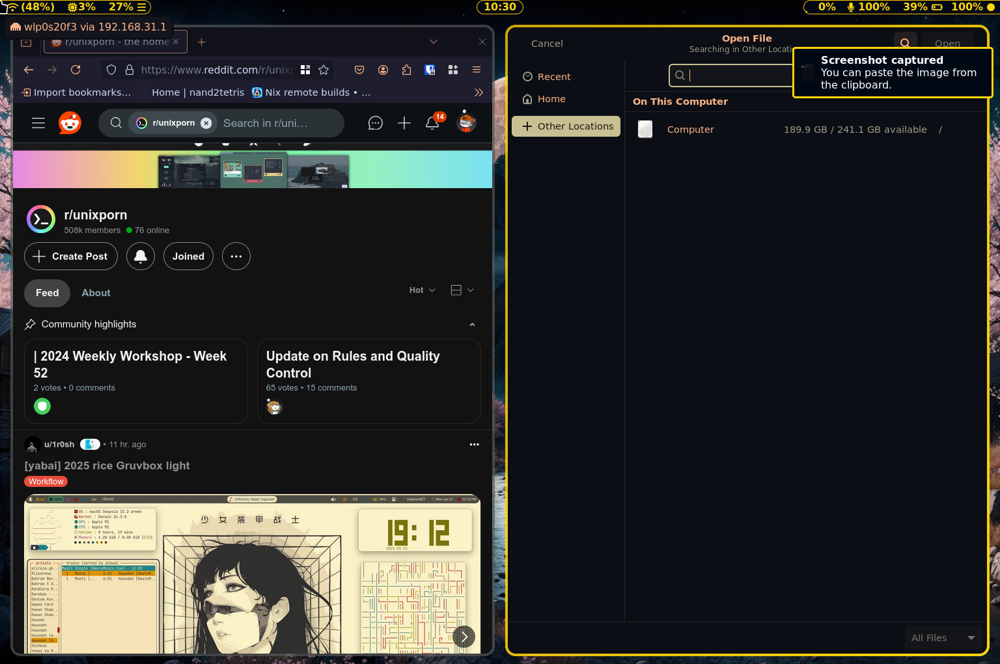
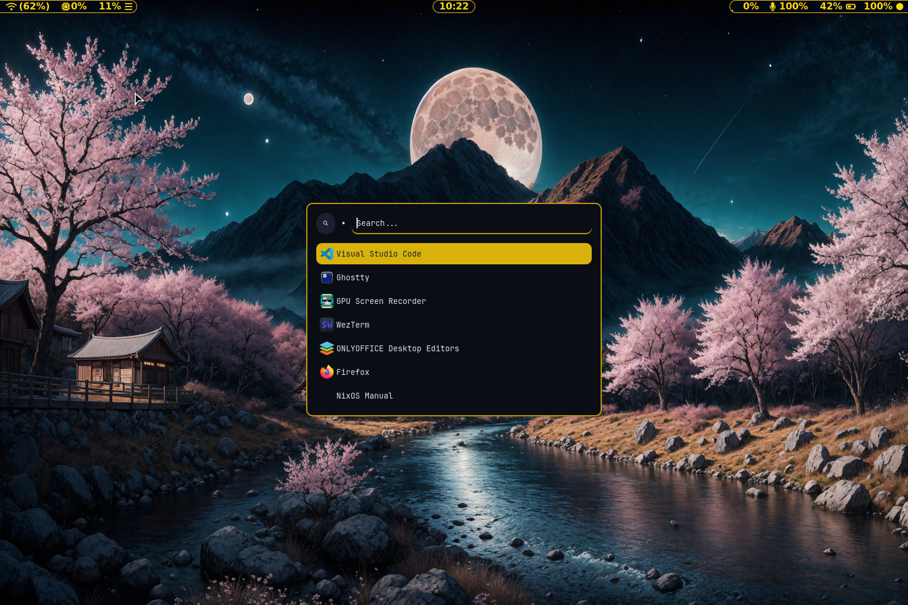
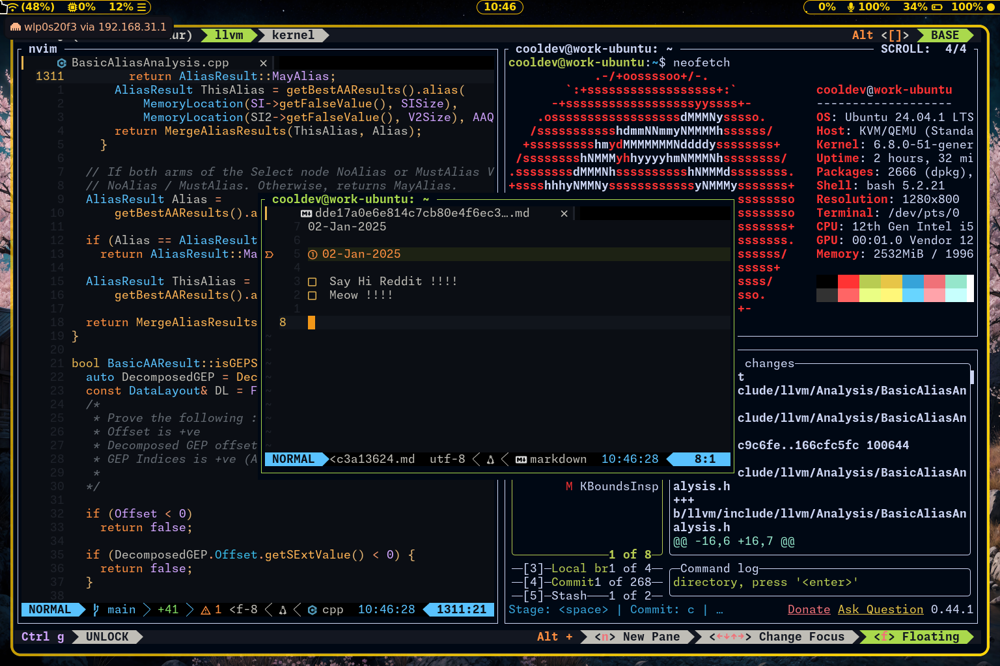
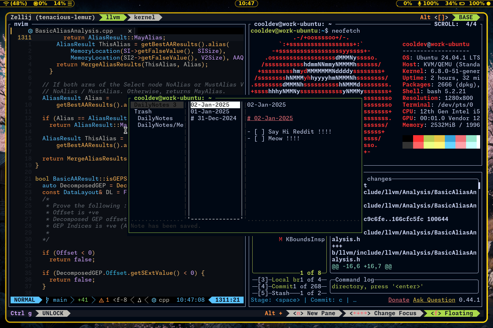
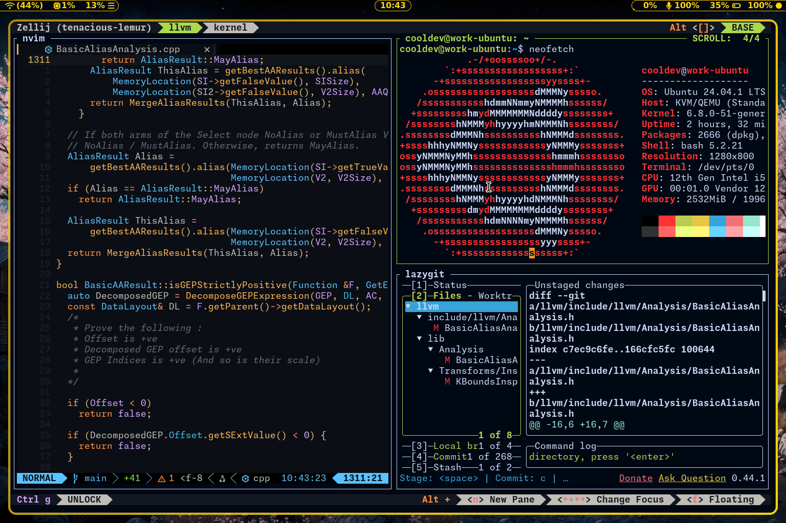

# Niri Wayland Dots

My Niri wayland dotfiles

- Gtk Theme (Apply Patch) : [Kanagawa-GKT-Theme](https://github.com/Fausto-Korpsvart/Kanagawa-GKT-Theme)([Patch](https://github.com/gopi487krishna/Kanagawa-GKT-Theme/commit/b1d3f25325200fd8267167eaacf1d6df596ca44d.patch))

- Neovim PDE (Jaggernaut) : [https://github.com/gopi487krishna/Jaggernaut-pde](https://github.com/gopi487krishna/Jaggernaut-pde)

- Wallpapers : [https://github.com/JaKooLit/Wallpaper-Bank](https://github.com/JaKooLit/Wallpaper-Bank)

- Window Manager : [https://github.com/YaLTeR/niri](https://github.com/YaLTeR/niri)

- Waybar : [https://github.com/Alexays/Waybar](https://github.com/Alexays/Waybar)

- Firefox Color : [https://addons.mozilla.org/en-US/firefox/addon/firefox-color/](https://addons.mozilla.org/en-US/firefox/addon/firefox-color/)

# Screenshots

